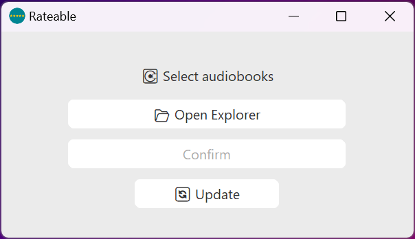
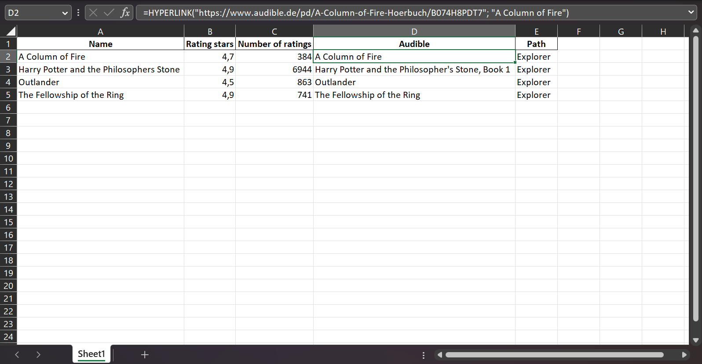

# Rateable

Rateable is a multiplatform desktop application that allows users to scrape and collect rating data from Audible for any audiobook files. The collected data can be stored in an Excel file and as ID3-tag. Rateable provides a convenient way to organize and analyze audiobook ratings.

## Features

- Scraping and Rating: Fetches rating data for each audiobook based on the folder name.
- Batch Selection: Enables batch processing for folders containing multiple audiobooks.
- Rating Updates: Allows users to update ratings for previous audiobooks to keep them up to date.
- Permanent Storage: Stores collected rating data permanently and provides the option to save it to an Excel sheet.
- Metadata (ToDo): Handles audiobook file metadata for enhanced information.
- ID3-tag (ToDo): Writes rating stars (and other metadata if not already available) to the audiobook files' ID3-tag.

## Installation

1. Clone the repository to your local machine.
2. Install the required dependencies with `pip install -r requirements.txt`.
3. Follow the instructions to download the [Chromium browser](https://www.chromium.org/getting-involved/download-chromium) and its [driver](https://chromedriver.chromium.org/downloads), placing the driver in the [assets folder](assets/).
4. Optional: Customize the TLD used for scraping the Audible website.
5. Run the app using `python main.py` (optionally package to make it executable).

## Usage

1. Launch the Rateable application.
2. Click "Open Explorer" to select the folder containing the audiobook files.
3. Confirm the selection, and the application will start scraping the rating data for each audiobook.
4. If using the application for the first time, specify the save path for the Excel file.
5. To update ratings for previous audiobooks, click "Update".
6. Open the Excel file by clicking "Open result".

## Screenshots

## Credits

- [CustomTkinter](https://github.com/TomSchimansky/CustomTkinter)
- [Selenium](https://www.selenium.dev/)
- [Pandas](https://pandas.pydata.org/)
- [SQLite3](https://www.sqlite.org/index.html)
- [Audible](https://www.audible.de/)
- [icons8](https://icons8.de/)

## Contributing

Contributions are welcome! Please create a new issue or submit a pull request for any issues or suggestions for improvements.